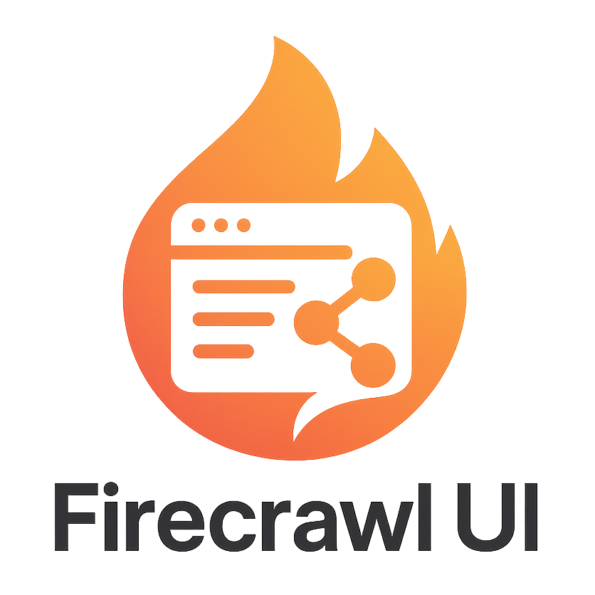
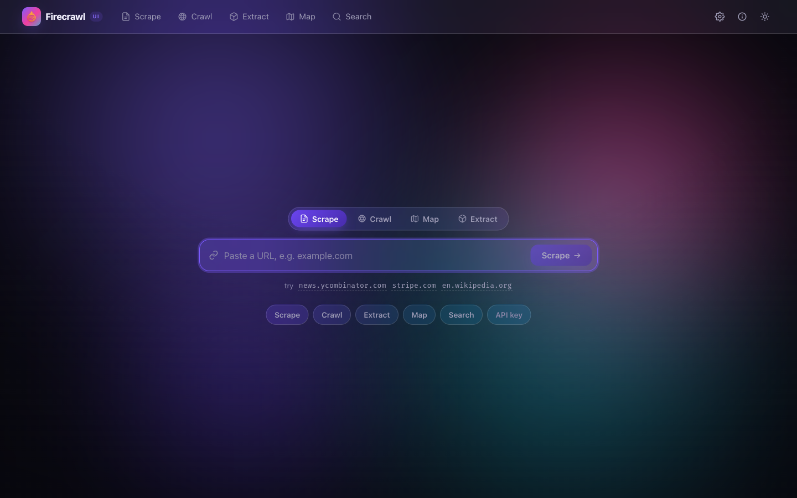
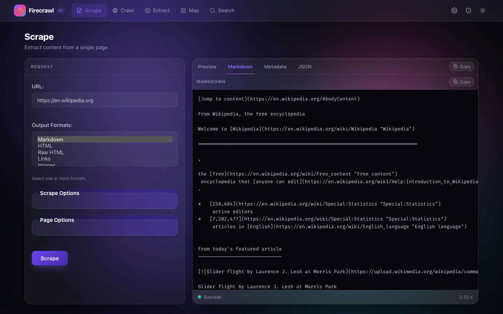
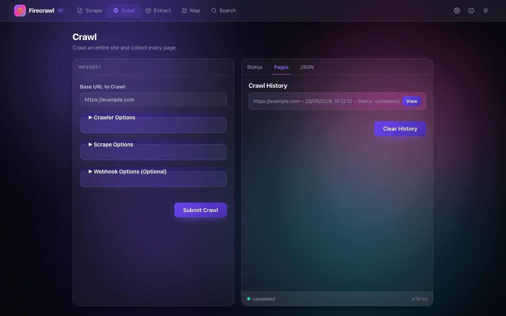
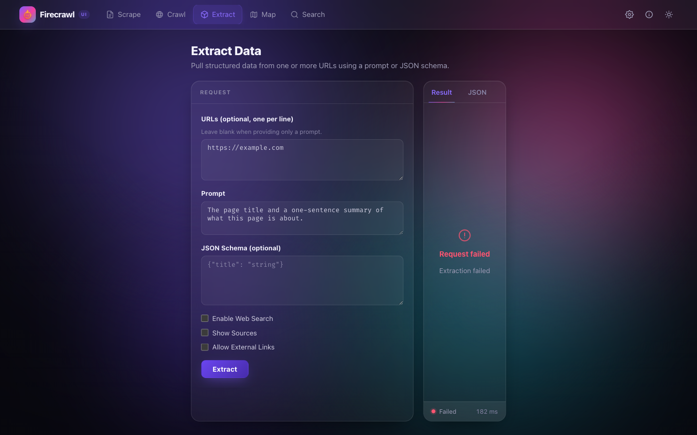
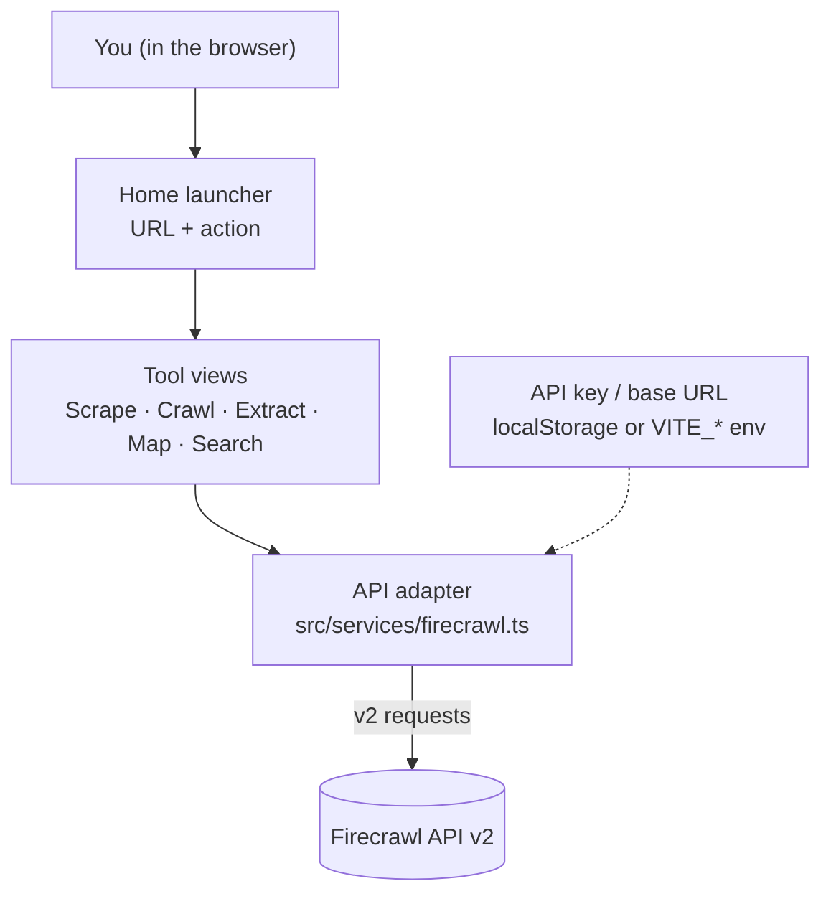

<div align="center">



# Firecrawl UI


[](LICENSE)
[](https://github.com/obeone/firecrawl-ui/actions/workflows/ci.yml)

</div>

---

Firecrawl UI is a single-page Vue 3 app that puts the [Firecrawl API](https://firecrawl.dev/)
tools behind a simple request/response interface. You don't need to write any
integration code: open the app, drop in a URL, and read the scraped content,
crawl results, or extracted data right in the browser. Your API key and data
stay local, and you can point it at the hosted Firecrawl service or your own
self-hosted instance.

## ✨ Features

|     | Feature          | Description                                                               |
| :-: | :--------------- | :------------------------------------------------------------------------ |
| 🔗  | **URL launcher** | Paste a URL on the home, pick an action, land in the tool pre-filled      |
| 📄  | **Scrape**       | Turn a single page into clean markdown, HTML, links or structured data    |
| 🕷️  | **Crawl**        | Traverse a whole site with depth, include/exclude rules and live progress |
| 🧠  | **Extract**      | Pull structured fields from URLs with a prompt or schema (AI)             |
| 🗺️  | **Map**          | List every reachable URL of a site to understand its structure            |
| 🔍  | **Search**       | Query the web and get ranked results with optional page content           |
| 🌗  | **Light / dark** | Glass + aurora theme, dark by default, remembered across sessions         |
| 🔑  | **Local config** | API key and base URL stored in your browser, never sent anywhere else     |
| 🏠  | **Self-hosting** | Point the base URL at your own Firecrawl instance (with or without a key) |

## 🚀 Demo

Try it now, no install needed: **<https://firecrawl-ui.obeone.cloud>**. Open the
settings page and add your API key (or a self-hosted base URL) to get started.



## 📦 Installation

### Local

```sh
git clone https://github.com/obeone/firecrawl-ui.git
cd firecrawl-ui
npm install
npm run dev
```

Open the URL printed in your terminal (default <http://localhost:5173/>), then
set your API key in the settings page.

### 🐳 Docker

```sh
docker run -p 8080:8080 obeoneorg/firecrawl-ui
```

Open <http://localhost:8080/>. Prebuilt images:

- `docker.io/obeoneorg/firecrawl-ui`
- `ghcr.io/obeone/firecrawl-ui`

## 🖼️ Screenshots

|              Scrape               |              Crawl              |
| :-------------------------------: | :-----------------------------: |
|  |  |

|               Extract               |
| :---------------------------------: |
|  |

Each tool is a two-pane playground: build the request on the left, read the
response (preview, JSON, links, …) on the right.

## ⚙️ Configuration

You can configure access two ways. The app shows a setup prompt on the home
until either an **API key** or a custom **API URL** (for a self-hosted
instance) is set.

**In the app:** open the settings page (gear icon) and enter your API key
and/or base URL. Values are saved to `localStorage`.

**Environment variables:** create a `.env` file in the project root. These are
read by `src/config/api.ts`.

```sh
VITE_FIRECRAWL_API_KEY=your_api_key
VITE_FIRECRAWL_API_BASE_URL=https://api.firecrawl.dev
```

| Variable                      | Description            | Default                     |
| :---------------------------- | :--------------------- | :-------------------------- |
| `VITE_FIRECRAWL_API_KEY`      | Firecrawl API key      | _(empty)_                   |
| `VITE_FIRECRAWL_API_BASE_URL` | Firecrawl service root | `https://api.firecrawl.dev` |

Precedence is `localStorage` > `VITE_*` env > default. Any trailing `/v1` or
`/v2` on the base URL is stripped automatically; the adapter targets **v2**.

## 🛠️ Commands

| Command           | Description                          |
| :---------------- | :----------------------------------- |
| `npm run dev`     | Start the dev server with hot reload |
| `npm run build`   | Type-check and build to `dist/`      |
| `npm run preview` | Preview the production build locally |
| `npm run lint`    | Run ESLint                           |
| `npm run format`  | Format with Prettier                 |

| Docker                                 | Description                  |
| :------------------------------------- | :--------------------------- |
| `docker build -t firecrawl-ui .`       | Build the image locally      |
| `docker run -p 8080:8080 firecrawl-ui` | Serve via Nginx on port 8080 |

The image is a multi-stage build (Node 24, then `nginx-unprivileged`). A custom
`nginx.conf` rewrites unknown paths to `index.html` for client-side routing.

## 🔌 API

The app targets the Firecrawl **v2** API (`/v2/*`) through the hand-written
adapter in `src/services/firecrawl.ts`. The full spec lives in
[`openapi_v2.yaml`](openapi_v2.yaml).

> Firecrawl still exposes the legacy **v1** API alongside v2, so existing v1
> integrations keep working, and this UI just builds its requests against v2.

## 🧭 Architecture


```mermaid
flowchart TB
    U["You (in the browser)"] --> H["Home launcher<br/>URL + action"]
    H --> V["Tool views<br/>Scrape · Crawl · Extract · Map · Search"]
    V --> AD["API adapter<br/>src/services/firecrawl.ts"]
    AD -->|"v2 requests"| FC[("Firecrawl API v2")]
    CFG["API key / base URL<br/>localStorage or VITE_* env"] -.-> AD
```

## 🤝 Contributing

Contributions are welcome. Run `npm run lint` and `npx prettier --check .`
before opening a pull request. PR titles follow `[firecrawl-ui] <Title>`.

## 📝 License

Released under the [MIT](LICENSE) license. Powered by
[Firecrawl](https://firecrawl.dev/).

Made by **Grégoire Compagnon (obeone)**.
